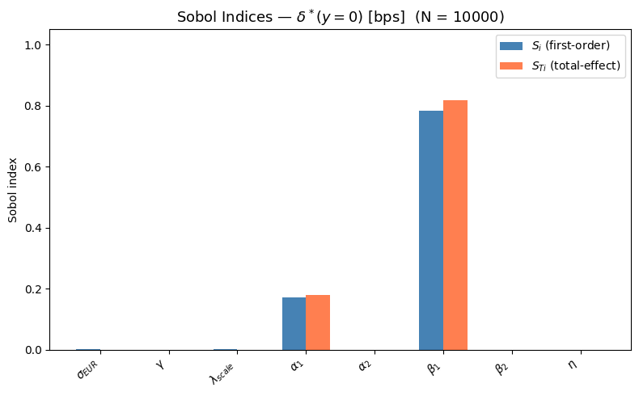
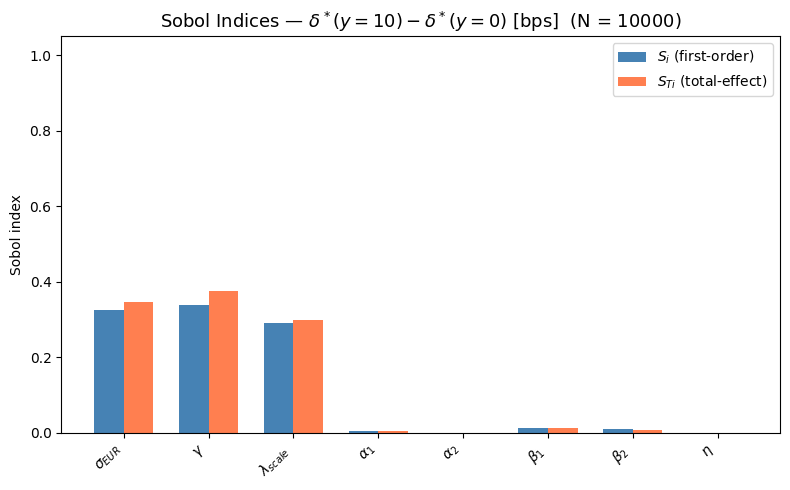
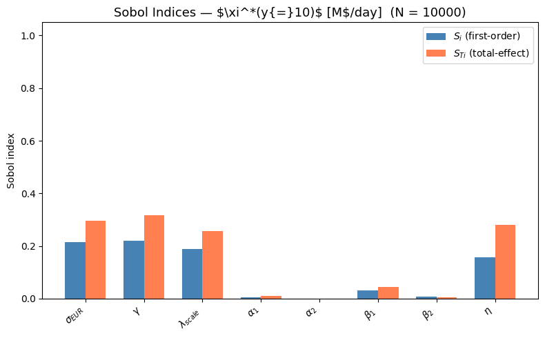
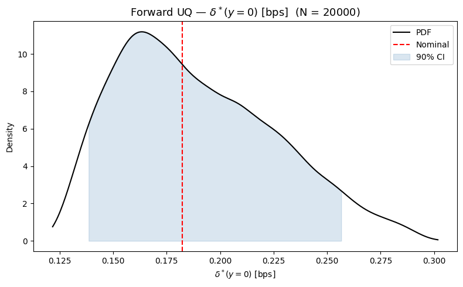
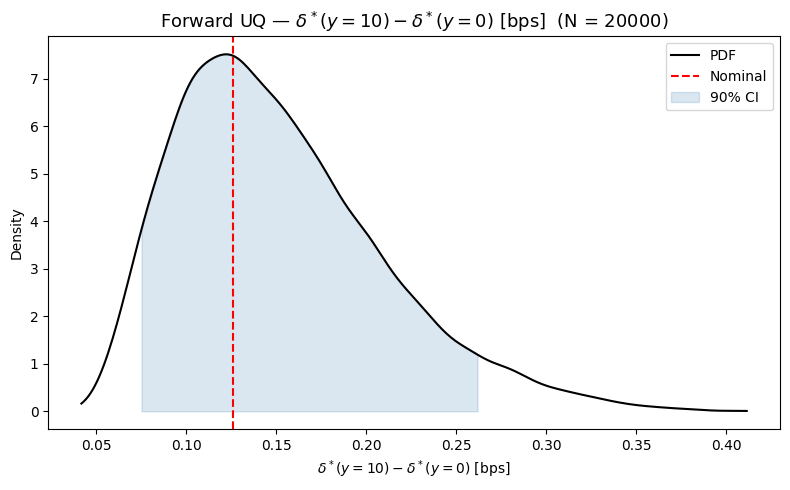
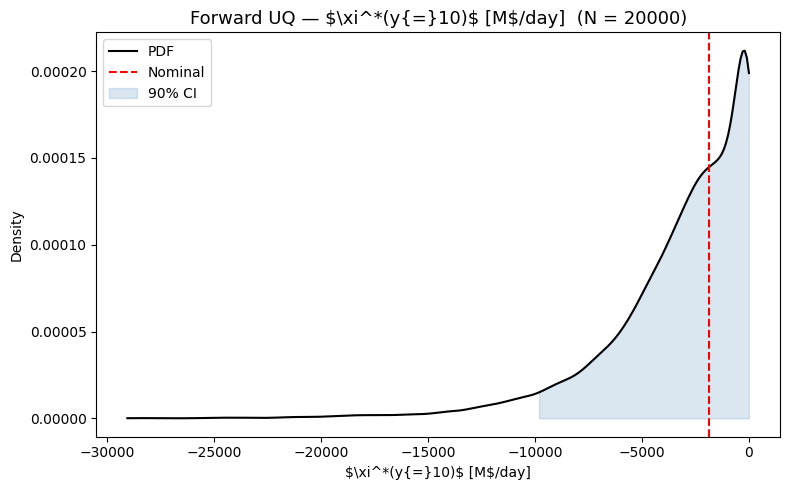

# Sensitivity Analysis — Results (2-Currency, ODE)

## How to read Sobol indices

A Sobol index is a number between 0 and 1 that tells you what fraction of the total output variance is caused by a given parameter.

- **First-order index S_i**: The fraction of output variance explained by parameter i *alone*, averaging over all other parameters. If S_i = 0.78, then 78% of the variance in the output comes from varying parameter i while all others are random.

- **Total-effect index S_Ti**: The fraction of output variance that involves parameter i in *any way* — alone or through interactions with other parameters. S_Ti >= S_i always. If S_Ti >> S_i, the parameter has strong interactions with other parameters.

- **S_Ti close to 0**: The parameter does not matter at all. It can be safely fixed at any value within its range without meaningfully affecting the output.

- **Sum of S_i close to 1**: The model is approximately additive — each parameter affects the output independently. Interactions are small.

- **Sum of S_Ti > 1**: There are interaction effects. The excess above 1 measures how much variance is "shared" between parameters (counted multiple times, once for each interacting parameter).

Example: if S_i(gamma) = 0.34 for the inventory skew, it means that 34% of the total uncertainty in the inventory skew comes from not knowing gamma precisely.

## Results

Parameters: 8, sampled uniformly (see setup.md for ranges).
Sample size: N = 10,000 (100,000 total model evaluations).
Model: 2-currency (USD, EUR) ODE approximation.

### QoI 1: Neutral spread delta*(y=0) [bps]

The markup the market maker quotes when inventory is flat.

| Parameter     | S_i   | S_Ti  |
|---------------|-------|-------|
| sigma_EUR     | 0.002 | 0.001 |
| gamma         | 0.000 | 0.001 |
| lambda_scale  | 0.002 | 0.001 |
| **alpha_1**   | **0.173** | **0.180** |
| alpha_2       | 0.000 | 0.000 |
| **beta_1**    | **0.784** | **0.818** |
| beta_2        | 0.000 | 0.000 |
| eta           | 0.000 | 0.000 |

Sum S_i = 0.96, Sum S_Ti = 1.00 — almost perfectly additive.

**Interpretation:** The neutral spread is controlled entirely by the aggressive-tier demand curve: beta_1 (78%) and alpha_1 (17%). All other parameters are irrelevant.

This makes sense mathematically: at y = 0, the value function gradient is zero (symmetric model, B = 0), so the "p" input to the quoting formula vanishes. The optimal markup reduces to maximizing f(delta) * delta over the logistic curve, which depends only on alpha and beta of the tier being quoted. The volatility, risk aversion, and arrival rates do not enter this calculation at all.

The passive tier (alpha_2, beta_2) does not appear because we are quoting tier 1 specifically.

**Practical implication:** If the bank wants to control the base spread, the only thing that matters is accurately estimating the client demand curve (alpha_1, beta_1). Volatility and risk aversion are irrelevant for the flat-inventory spread.

### QoI 2: Inventory skew delta*(y=10) - delta*(y=0) [bps]

How much the markup changes when the market maker is 10 M$ long EUR, compared to flat.

| Parameter     | S_i   | S_Ti  |
|---------------|-------|-------|
| **sigma_EUR** | **0.325** | **0.347** |
| **gamma**     | **0.338** | **0.376** |
| **lambda_scale** | **0.291** | **0.299** |
| alpha_1       | 0.005 | 0.006 |
| alpha_2       | 0.001 | 0.001 |
| beta_1        | 0.012 | 0.012 |
| beta_2        | 0.011 | 0.007 |
| eta           | 0.000 | 0.000 |

Sum S_i = 0.98, Sum S_Ti = 1.05 — nearly additive with small interactions.

**Interpretation:** The inventory skew is driven equally by three parameters: volatility sigma (33%), risk aversion gamma (34%), and market activity lambda (29%). The demand curve parameters and execution cost are irrelevant.

This makes sense: the skew comes from the value function gradient 2*A(0)*y, where A(0) is the Riccati solution. The matrix A encodes how much the model penalizes inventory, and it depends on:
- sigma: higher volatility -> more inventory risk -> larger A -> more skew
- gamma: higher risk aversion -> larger running penalty -> larger A -> more skew
- lambda: higher arrival rates -> more quoting gain -> different A structure -> different skew

The demand curve parameters (alpha, beta) affect the *level* of the spread but not its *inventory dependence*, because they enter through the Hamiltonian coefficients which scale A uniformly.

**Practical implication:** The inventory adjustment depends on accurately knowing the market conditions (volatility, flow volume) and the risk preference. The client demand model doesn't matter for this.

### QoI 3: Hedge rate xi*(y=10) [M$/day]

How aggressively the model hedges when holding 10 M$ EUR.

| Parameter     | S_i   | S_Ti  |
|---------------|-------|-------|
| **sigma_EUR** | **0.215** | **0.296** |
| **gamma**     | **0.220** | **0.317** |
| **lambda_scale** | **0.188** | **0.257** |
| alpha_1       | 0.006 | 0.009 |
| alpha_2       | 0.000 | 0.001 |
| beta_1        | 0.030 | 0.044 |
| beta_2        | 0.006 | 0.006 |
| **eta**       | **0.157** | **0.282** |

Sum S_i = 0.82, Sum S_Ti = 1.21 — **significant interactions**.

**Interpretation:** Four parameters drive the hedge rate: sigma (22%), gamma (22%), lambda (19%), and eta (16%). But the total-effect indices are notably larger than the first-order ones (especially for eta: 0.16 vs 0.28), indicating strong interaction effects.

The interactions come from the hedge rate formula: xi* = (p - psi) / (2*eta), where p depends on the value function gradient (which depends on sigma, gamma, lambda). So eta interacts multiplicatively with all the parameters that affect the gradient — changing eta amplifies or dampens the effect of changing sigma, for example.

The forward UQ shows this leads to enormous practical uncertainty: the 90% CI is [-9812, 0] M$/day around a mean of -3207, with a standard deviation of 3414. The distribution is heavily left-skewed because small eta values produce extremely large hedge rates (the 1/eta effect).

**Practical implication:** The hedge rate is the least robust part of the strategy. It depends on everything: market conditions (sigma, lambda), risk preference (gamma), and execution cost estimation (eta). Getting eta wrong is particularly dangerous because it enters inversely — underestimating market impact leads to dramatically over-aggressive hedging.

### Forward UQ summary

| QoI | Mean | Std | 90% CI | Nominal |
|-----|------|-----|--------|---------|
| delta*(y=0) [bps] | 0.189 | 0.037 | [0.138, 0.257] | 0.182 |
| delta*(y=10) - delta*(y=0) [bps] | 0.152 | 0.058 | [0.075, 0.262] | 0.126 |
| xi*(y=10) [M$/day] | -3207 | 3414 | [-9812, 0] | -1879 |

The neutral spread is relatively robust (std/mean ~ 20%), the inventory skew is moderately uncertain (std/mean ~ 38%), and the hedge rate is highly uncertain (std/mean > 100%).

## Parameters that can be safely fixed

Based on S_Ti being close to zero across all QoIs:

- **alpha_2** (passive tier logistic shift): irrelevant for all three QoIs
- **beta_2** (passive tier logistic slope): irrelevant for all three QoIs

These can be fixed at their nominal values without loss. This is expected — we are evaluating tier 1 quotes and the two tiers do not interact in the ODE model.

## Key takeaway

**Different aspects of the market-making strategy are sensitive to completely different parameters:**

| What the bank cares about | Driven by |
|--------------------------|-----------|
| Base spread (profitability per trade) | Client demand curve (beta_1, alpha_1) |
| Inventory adjustment (risk management) | Market conditions (sigma, gamma, lambda) |
| Hedge aggressiveness | Everything + strong interactions |

This means there is no single "most important parameter." A bank that only cares about setting competitive spreads needs to calibrate the demand curve well. A bank that cares about inventory risk management needs accurate volatility and flow estimates. And hedge execution requires getting *all* parameters right, especially the execution cost eta.
